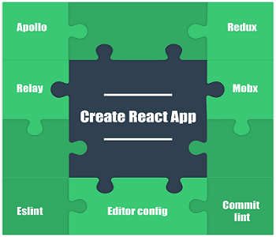

<h1 align="center">Awesome React App</h1>


<p align="center">
  <a href="https://github.com/ifactory-solutions/awesome-react-app/stargazers">
    
  </a>
  <a href="https://github.com/ifactory-solutions/awesome-react-app/issues">
    
  </a>
  <a href="https://github.comifactory-solutions/awesome-react-app/pulls">
    
  </a>
  <a href="https://gitter.im/ifactory-open-source/awesome-react-app">
    
  </a>
  <a href="http://makeapullrequest.com">
    
  </a>
</p>


<p align="center" margin-bottom="0">
  <a href="" target="\_blank">
    
  </a>
</p>


Always the latest version of [`create-react-app`](https://github.com/facebookincubator/create-react-app)  with awesome configurations (linter, commit linter, husky, .editorconfig, etc)


## Quick Overview

```sh
npm install -g awesome-react-app

awesome-react-app my-app
cd my-app/
npm start
```

Then open [http://localhost:3000/](http://localhost:3000/) to see your app.<br>
When you’re ready to deploy to production, create a minified bundle with `npm run build`.


### Get Started Immediately

You **need** to have [`create-react-app`](https://github.com/facebookincubator/create-react-app) installed.

You **don’t** need to install or configure tools like Webpack or Babel.<br>
They are preconfigured and hidden so that you can focus on the code.

Just create a project, answer the hooks questions and you’re good to go.

## Getting Started

### Installation

Install it once globally:

```sh
npm install -g awesome-react-app
```

**You’ll need to have Node >= 6 on your machine**. You can use [`nvm`](https://github.com/creationix/nvm#installation) to easily switch Node versions between different projects.

**You’ll need to have Create React App on your machine**. Awesome React App is
a wrapper from [**Create React App**](https://github.com/facebookincubator/create-react-app) with some cool stuff (linter, commit linter, husky, .editorconfig, etc).

### Creating an Awesome App

To create a new app, run:

```sh
awesome-react-app my-app
cd my-app
```

It will create a directory called `my-app` inside the current folder.<br>
Inside that directory, it will ask to you for add some configurations (eslint,
  editorconfig) and generate the initial project structure and install the dependencies.

Once the installation is done, you can run some commands inside the project folder:

### `npm start` or `yarn start`

Runs the app in development mode.<br>
Open [http://localhost:3000](http://localhost:3000) to view it in the browser.

The page will automatically reload if you make changes to the code.<br>
You will see the build errors and lint warnings in the console.


### `npm test` or `yarn test`

Runs the test watcher in an interactive mode.<br>
By default, runs tests related to files changed since the last commit.

### `npm run build` or `yarn build`

Builds the app for production to the `build` folder.<br>
It correctly bundles React in production mode and optimizes the build for the best performance.

The build is minified and the filenames include the hashes.<br>
By default, it also includes a service worker so that your app loads from local cache on future visits.

Your app is ready to be deployed.

## User Guide

You can see the [Official Create React App User Guide](https://github.com/facebookincubator/create-react-app/blob/master/packages/react-scripts/template/README.md) for more information on different topics.

## Contributing

We'd love to have your helping hand on `awesome-react-app`! See [CONTRIBUTING.md](CONTRIBUTING.md) for more information on what we're looking for and how to get started.
